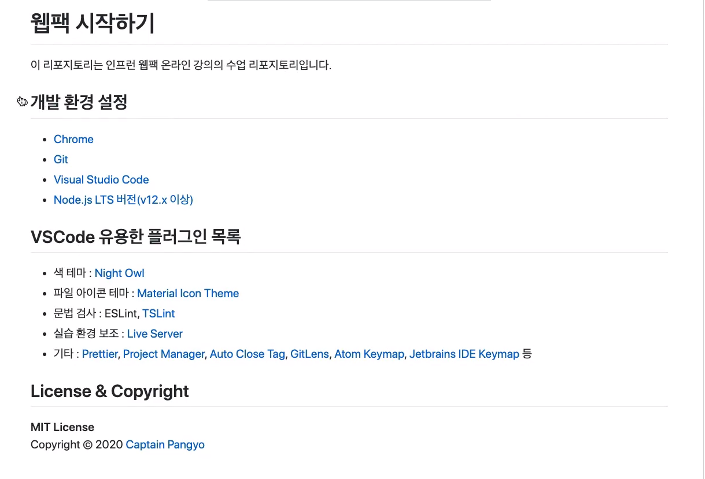

# 쉽게 배우는 Webpack

### 순서

- 프론트엔드 빌드 시스템
  - NPM, Webpack
- 자바스크립트 모듈화 (AMD, Common.js, ES6 Modules)
- 웹팩 개요 (등장 배경, 철학)
- 웹팩 주요 속성4가지
- 배포 환경에서 알고 있어야 할 웹팩 특징과 설정 

### 개발환경 구성

- 참고: https://github.com/joshua1988/LearnWebpack

- 셋팅 단축키(VSCode)
  - 윈도우: ctrl + shift + p
  - 맥: cmd + shift + p

### 교안

- https://joshua1988.github.io/webpack-guide

#### Nodejs

> javascript 개발 환경

#### NPM

> node package manager
>
> 자바스크립트 패키지 관리

- nodejs 라이브러리 검색

