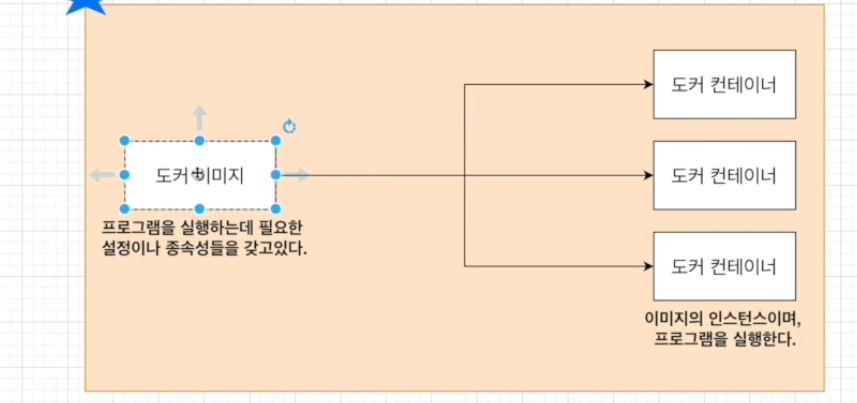

# 따라하며 배우는 도커 CI

도커를 쓰는 이유 

- 도커스를 쓰지 않으면 설치 과정에서 운영체제,서버,패키지와 관련되어서 오류가 발생된다.

컨테이너 

- 코드와 모든 종속성을 패키지화하여 응용 프로그램이 한 컴퓨팅 환경에서 다른 컴퓨팅 환경으로 빠르고 안정적으로 실행되도록하는 소프트웨어 표준 단위

컨테이너 이미지 

- 코드, 런타임, 시스템 도구, 시스템 라이브러리 및 설정과 같은 응용프로그램을 실행하는데 필요한 모든 것을 포함하는 가볍고 독립적이면 실행가능한 소프트웨어 패키지이다.
- 런타임에 컨테이너가 되고, 도커 컨테이너의 경우 도커 엔진에서 실행될 때 이미지가 컨테이너가 된다.

